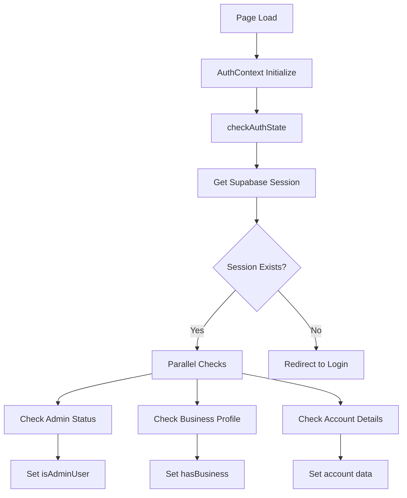

# Authentication System Documentation

## Executive Summary

Your application uses a sophisticated authentication system built on Supabase Auth with custom extensions for admin roles and multi-account support. The system is well-architected but has several areas that need attention to resolve your authentication issues.

## Current Account Selection (Source of Truth)

- Account selection persists in localStorage using the key pattern `promptreviews_selected_account_{userId}`.
- The client includes the selected account in requests via the `X-Selected-Account` header (see `src/utils/apiClient.ts`).
- API routes resolve the effective account with `getRequestAccountId(request, userId, supabase)` which:
  - Validates the `X-Selected-Account` belongs to the authenticated user via `account_users`.
  - Falls back to automatic selection (`getAccountIdForUser`) when missing/invalid.
- No httpOnly cookie is used for account selection today. If documentation elsewhere suggests this, consider it historical; the current implementation is localStorage + validated header.
- Recommended for new code: use `useAuth()` to read `selectedAccountId` from the `CompositeAuthProvider`; avoid introducing new parallel account selection hooks.

## Core Components

### 1. AuthContext (`src/contexts/AuthContext.tsx`)
- **Purpose**: Centralized authentication state management
- **Key Features**:
  - Single source of truth for auth state
  - Session management with auto-refresh
  - Admin status checking
  - Multi-account support
  - Payment/subscription status tracking
  - Business profile integration
  - Email verification status

### 2. Admin System (`src/utils/admin.ts`)
- **Implementation**: Simple `is_admin` boolean column in accounts table
- **Admin Detection**: 
  - Checks `accounts.is_admin` column
  - Auto-grants admin status for emails in `ADMIN_EMAILS` env variable
  - Provides functions for admin content management (announcements, quotes)

### 3. Multi-Account Architecture (`src/utils/accountUtils.ts`)
- **Account Selection Priority**:
  1. User's manually selected account (stored in localStorage)
  2. Team accounts with active plans (highest priority)
  3. Owned accounts with proper plans
  4. Any team account (even without plan)
  5. Fallback to any account

- **Account Roles**:
  - `owner`: Full control
  - `admin`: Administrative access
  - `member`: Regular team member

## Database Schema

### Key Tables:
1. **accounts**: Primary account table (id matches user_id for single accounts)
2. **account_users**: Links users to accounts with roles (multi-account support)
3. **businesses**: Business profiles linked to accounts

### Relationships:
```
auth.users -> accounts (1:1 for primary account)
auth.users -> account_users -> accounts (N:M for multi-account)
accounts -> businesses (1:N)
```

## Authentication Flow

### 1. Initial Load


### 2. Multi-Account Selection
- Users can manually switch between accounts.
- Selection is stored in localStorage with key: `promptreviews_selected_account_{userId}`.
- Server-side validation ensures selected account still exists and user has access (via `getRequestAccountId`).

### 3. OAuth Flow (Google Business)
- Handles Google OAuth callback with retry logic
- Stores tokens in `google_business_profiles` table
- Maintains user session during OAuth process
- Validates required scopes (business.manage)

## Identified Issues and Recommendations

### Critical Issues

#### 1. Session Management Timing Issues
**Problem**: Race conditions during authentication, especially with OAuth flows
**Location**: `AuthContext.tsx:928-936`, OAuth callback retry logic
**Impact**: Users may experience unexpected logouts or auth failures

**Recommendation**:
- Increase retry attempts for OAuth flows (currently 10, consider 15)
- Implement exponential backoff with jitter
- Add session persistence check before declaring auth failure

#### 2. Multi-Account Context Switching
**Problem**: Complex account selection logic may cause confusion for admin users with multiple accounts
**Location**: `accountUtils.ts:388-494`
**Impact**: Admin users may not see expected data when switching contexts

**Recommendation**:
- Add visual indicator showing current account context
- Implement account switcher UI component
- Add logging for account switches for debugging

#### 3. Admin Role Verification
**Problem**: Admin status checked on every auth state change
**Location**: `admin.ts:14-74`
**Impact**: Potential performance impact and race conditions

**Recommendation**:
- Cache admin status more aggressively (current: 5 minutes)
- Consider using JWT claims for admin status
- Implement role-based access control (RBAC) system

### Performance Optimizations

1. **Reduce Database Queries**:
   - Combine account_users and accounts queries
   - Use database views for common queries
   - Implement query result caching

2. **Session Management**:
   - Remove custom auto-refresh (line 1007-1009 in AuthContext)
   - Rely on Supabase's built-in session management
   - Reduce auth state change listeners

3. **Loading State Management**:
   - Implement proper loading state coordination
   - Fix stuck loading states with timeouts (currently 8s/20s)

### Security Considerations

1. **Admin Access**:
   - Admin status stored in database, not JWT
   - Consider adding audit logging for admin actions
   - Implement IP-based restrictions for admin access
2. **Multi-Account Access**:
   - Validate account access on every request (implemented via `getRequestAccountId`)
   - Note: While selection is stored in localStorage client-side, server validation prevents cross-account data access even if the header is manipulated

2. **Multi-Account Access**:
   - Proper RLS policies on account_users table
   - Validate account access on every request
   - Implement session invalidation on role changes

3. **OAuth Token Storage**:
   - Tokens stored encrypted in database
   - Implement token rotation
   - Add token expiry monitoring

## Best Practices for Your Use Case

### As an Admin with Multiple Accounts:

1. **Account Switching**:
   ```typescript
   // Manually switch account
   setStoredAccountSelection(userId, targetAccountId);
   // Then refresh auth context
   await refreshAuth();
   ```

2. **Debug Authentication**:
   ```typescript
   // Enable dev mode bypass (development only)
   localStorage.setItem('dev_auth_bypass', 'true');
   ```

3. **Monitor Auth State**:
   - Check browser console for auth logs
   - Use React DevTools to inspect AuthContext state
   - Monitor network tab for failed auth requests

### Common Troubleshooting

1. **Stuck Loading States**:
   - Clear browser cache and cookies
   - Check for JavaScript errors in console
   - Verify Supabase session in Application > Cookies

2. **Wrong Account Context**:
   - Clear account selection: `localStorage.removeItem('promptreviews_selected_account_{userId}')`
   - Force refresh: `window.location.reload()`

3. **OAuth Connection Issues**:
   - Verify Google OAuth credentials
   - Check redirect URI matches exactly
   - Ensure business.manage scope is granted

## Recommended Immediate Actions

1. **Add Comprehensive Logging**:
   - Implement structured logging for auth events
   - Add correlation IDs for tracking auth flows
   - Set up error monitoring (Sentry/LogRocket)

2. **Implement Auth Health Check Endpoint**:
   ```typescript
   // /api/auth/health
   - Check Supabase connection
   - Verify database access
   - Test admin role detection
   - Validate OAuth token status
   ```

3. **Create Admin Dashboard**:
   - Show all accounts you have access to
   - Display current account context
   - Quick switch between accounts
   - Auth debugging tools

4. **Document Edge Cases**:
   - Multiple browser tabs
   - Session expiry during form submission
   - OAuth timeout scenarios
   - Network interruption recovery

## Architecture Improvements

### Short-term (1-2 weeks):
1. Implement proper error boundaries for auth failures
2. Add retry logic with exponential backoff
3. Create auth debug mode for development
4. Improve loading state management

### Medium-term (1-2 months):
1. Migrate to JWT-based role management
2. Implement proper RBAC system
3. Add audit logging for all auth events
4. Create automated auth testing suite

### Long-term (3-6 months):
1. Consider implementing SSO for enterprise accounts
2. Add two-factor authentication
3. Implement session management dashboard
4. Create auth microservice for better isolation

## Conclusion

Your authentication system is well-designed but suffering from timing issues and complexity around multi-account management. The admin role implementation is straightforward but could benefit from caching improvements. The multi-account system is sophisticated but needs better UI indicators and debugging tools.

The most critical issues to address are:
1. Session timing race conditions
2. Loading state management
3. Account context clarity for admin users

With the recommended improvements, the system will be more robust and easier to debug when issues arise.
