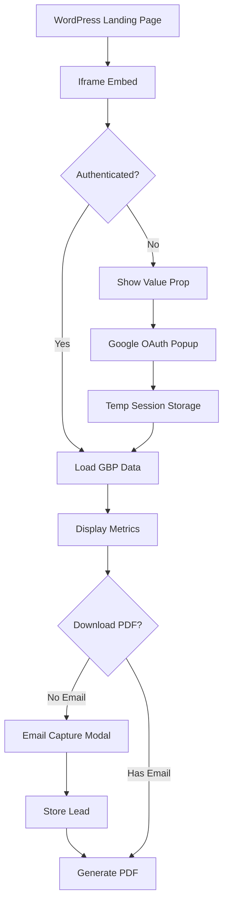

# Google Business Optimizer - Lead Generation Tool Plan

## Overview
Create an embeddable Google Business Profile analyzer tool that works as a lead generation funnel while reusing existing dashboard components. The tool will be embedded on the WordPress marketing site but share components with the main app.

## Architecture Principles

### 1. Component Reusability Strategy
**Goal:** Single source of truth for all business logic and UI components

```
/src/components/GoogleBusinessProfile/
├── core/                      # Shared components (used by both app & embed)
│   ├── OverviewStats.tsx      # Move existing component here
│   ├── BusinessHealthMetrics.tsx
│   ├── OptimizationOpportunities.tsx
│   ├── PerformanceMetrics.tsx
│   └── hooks/
│       ├── useGoogleBusinessData.ts
│       └── useBusinessInsights.ts
│
├── app/                        # App-specific wrappers
│   ├── OverviewStatsApp.tsx   # Wraps core with app-specific features
│   └── BusinessHealthMetricsApp.tsx
│
└── embed/                      # Embed-specific wrappers
    ├── OverviewStatsEmbed.tsx # Wraps core with lead-gen features
    ├── BusinessHealthMetricsEmbed.tsx
    └── EmailGate.tsx           # Email capture modal
```

### 2. Data Flow Architecture



## Implementation Phases

### Phase 1: Component Refactoring
**Timeline:** 2-3 hours
**Goal:** Separate core logic from app-specific features

1. **Create core components directory**
   ```typescript
   // src/components/GoogleBusinessProfile/core/OverviewStats.tsx
   export interface OverviewStatsProps {
     // Pure data props
     totalReviews: number;
     reviewTrend: number;
     averageRating: number;
     monthlyReviewData: MonthlyReviewData[];

     // Optional customization
     showUpgradePrompts?: boolean;
     compactMode?: boolean;
     onMetricClick?: (metric: string) => void;
   }
   ```

2. **Extract shared hooks**
   ```typescript
   // src/components/GoogleBusinessProfile/core/hooks/useGoogleBusinessData.ts
   export function useGoogleBusinessData(locationId: string, options?: {
     isEmbed?: boolean;
     tempToken?: string;
   }) {
     // Shared data fetching logic
     // Handle both authenticated (app) and temp-token (embed) scenarios
   }
   ```

3. **Create environment-specific wrappers**
   ```typescript
   // App wrapper adds navigation, full features
   // Embed wrapper adds email gates, upgrade CTAs
   ```

### Phase 2: Embed Infrastructure
**Timeline:** 3-4 hours
**Goal:** Create embeddable version with proper iframe communication

1. **Embed layout** (`src/app/(embed)/layout.tsx`)
   - No navigation
   - Minimal branding
   - PostMessage handler
   - Session management

2. **OAuth flow for embeds**
   ```typescript
   // src/app/api/auth/google/embed/route.ts
   - Popup-based auth
   - Temporary token generation (1-hour expiry)
   - No permanent account creation
   ```

3. **IFrame communication layer**
   ```typescript
   // src/utils/embed/iframeBridge.ts
   export class IframeBridge {
     // Height management
     sendHeight() {
       window.parent.postMessage({
         type: 'gbp-resize',
         height: document.body.scrollHeight
       }, '*');
     }

     // OAuth coordination
     requestOAuth() {
       window.parent.postMessage({
         type: 'gbp-oauth-request'
       }, '*');
     }
   }
   ```

### Phase 3: Lead Capture System
**Timeline:** 2-3 hours
**Goal:** Progressive email capture with value delivery

1. **Lead capture points**
   - Before PDF download (required)
   - After viewing metrics (optional - for newsletter)
   - On high-value insights (soft ask)

2. **Database schema**
   ```sql
   -- migrations/[timestamp]_create_optimizer_leads.sql
   CREATE TABLE optimizer_leads (
     id UUID DEFAULT uuid_generate_v4() PRIMARY KEY,
     email VARCHAR(255) NOT NULL,
     google_account_id TEXT,
     business_name TEXT,
     location_name TEXT,

     -- Metrics snapshot for follow-up
     total_reviews INTEGER,
     average_rating DECIMAL(2,1),
     optimization_score INTEGER,
     insights JSONB,

     -- Marketing attribution
     source VARCHAR(100),
     utm_campaign TEXT,
     utm_source TEXT,
     utm_medium TEXT,

     -- Lifecycle
     created_at TIMESTAMP DEFAULT NOW(),
     last_analyzed_at TIMESTAMP,
     email_verified BOOLEAN DEFAULT FALSE,
     converted_to_trial BOOLEAN DEFAULT FALSE,
     converted_to_customer BOOLEAN DEFAULT FALSE
   );

   CREATE INDEX idx_optimizer_leads_email ON optimizer_leads(email);
   CREATE INDEX idx_optimizer_leads_google_id ON optimizer_leads(google_account_id);
   ```

3. **Email capture component**
   ```typescript
   // src/components/GoogleBusinessProfile/embed/EmailGate.tsx
   interface EmailGateProps {
     trigger: 'pdf_download' | 'view_insights' | 'unlock_features';
     onSuccess: (email: string) => void;
     businessName?: string;
   }
   ```

### Phase 4: Temporary Session Management
**Timeline:** 2 hours
**Goal:** Secure temporary access without creating accounts

1. **Session storage strategy**
   ```typescript
   // src/lib/embed/sessionStore.ts
   interface EmbedSession {
     id: string;
     googleTokens: {
       access_token: string;
       refresh_token: string;
       expires_at: number;
     };
     locationData: GoogleBusinessLocation[];
     email?: string;
     createdAt: number;
     expiresAt: number; // 1 hour
   }

   // Use Supabase edge functions or Redis for storage
   export class EmbedSessionStore {
     async create(googleTokens: TokenSet): Promise<string>
     async get(sessionId: string): Promise<EmbedSession | null>
     async updateEmail(sessionId: string, email: string): Promise<void>
   }
   ```

### Phase 5: WordPress Integration
**Timeline:** 1-2 hours
**Goal:** Seamless embed on marketing site

1. **WordPress plugin/shortcode**
   ```php
   // [gbp_optimizer height="900"]
   function gbp_optimizer_shortcode($atts) {
     $atts = shortcode_atts([
       'height' => '900',
       'source' => 'wordpress'
     ], $atts);

     return sprintf(
       '<div id="gbp-optimizer-embed"
            data-height="%s"
            data-source="%s">
       </div>
       <script src="https://app.promptreviews.app/embed.js"></script>',
       esc_attr($atts['height']),
       esc_attr($atts['source'])
     );
   }
   ```

2. **Embed loader script**
   ```javascript
   // public/embed.js
   (function() {
     const container = document.getElementById('gbp-optimizer-embed');
     const iframe = document.createElement('iframe');
     // Configuration and message handling
   })();
   ```

## Component Sharing Strategy

### Shared Core Components
These components will be pure, data-driven, and environment-agnostic:

1. **OverviewStats** - Review statistics display
2. **BusinessHealthMetrics** - Profile completeness & engagement
3. **OptimizationOpportunities** - Improvement suggestions
4. **PerformanceMetrics** - Views, searches, actions data

### Environment-Specific Features

**App Version:**
- Full navigation
- Multiple locations
- Historical data (90+ days)
- Team collaboration
- Automated monitoring
- API access

**Embed Version:**
- Single location (or first 3)
- 30-day data only
- Email-gated PDF export
- Upgrade CTAs
- Limited insights
- Session-based (1 hour)

## API Endpoints Structure

```typescript
// Shared endpoints (with context awareness)
/api/google-business-profile/
├── overview/route.ts          # Checks context (app vs embed)
├── insights/route.ts          # Limits data based on context
└── export-pdf/route.ts        # Requires email for embeds

// Embed-specific endpoints
/api/embed/
├── auth/google/route.ts       # Popup-based OAuth
├── session/create/route.ts    # Temp session creation
├── lead/capture/route.ts      # Email & lead storage
└── analytics/track/route.ts   # Conversion tracking
```

## Security Considerations

1. **Rate Limiting**
   - Per IP: 10 analyses per hour
   - Per email: 5 analyses per day
   - Per Google account: 20 analyses per day

2. **Data Protection**
   - No persistent storage of Google tokens for embed users
   - Session data expires after 1 hour
   - Email required for data export
   - GDPR compliance for lead storage

3. **API Security**
   ```typescript
   // Middleware to check context
   export async function validateEmbedSession(req: Request) {
     const sessionId = req.headers.get('X-Embed-Session');
     if (!sessionId) return null;

     const session = await embedSessionStore.get(sessionId);
     if (!session || session.expiresAt < Date.now()) {
       return null;
     }

     return session;
   }
   ```

## Analytics & Tracking

### Funnel Events
```typescript
const FUNNEL_EVENTS = {
  // Awareness
  'embed_loaded': { page: 'wordpress', source: utm_source },
  'value_prop_viewed': { duration: seconds },

  // Interest
  'analyze_clicked': { position: 'hero' | 'sticky' },
  'oauth_started': {},
  'oauth_completed': { hasEmail: boolean },

  // Consideration
  'metrics_viewed': { score: number, issues: number },
  'insight_expanded': { type: string },
  'pdf_download_clicked': {},

  // Conversion
  'email_submitted': { trigger: string },
  'pdf_downloaded': {},
  'upgrade_clicked': { feature: string },
  'trial_started': { plan: string }
};
```

### Lead Scoring
```typescript
interface LeadScore {
  engagement: number;  // Based on interactions
  potential: number;   // Based on business size/reviews
  urgency: number;     // Based on optimization opportunities
}
```

## Maintenance Strategy

### Shared Component Updates
1. All business logic stays in core components
2. Bug fixes automatically apply to both app and embed
3. New features can be flagged: `if (context === 'embed') { ... }`

### Testing Strategy
```typescript
// Test core components with different contexts
describe('OverviewStats', () => {
  it('renders in app context', () => {
    render(<OverviewStats {...props} context="app" />);
  });

  it('renders in embed context with CTAs', () => {
    render(<OverviewStats {...props} context="embed" />);
    expect(screen.getByText('Upgrade for full access')).toBeInTheDocument();
  });
});
```

## Development Workflow

### Using Multiple Agents

**Agent 1: Component Refactoring**
- Extract core components
- Create shared hooks
- Build environment wrappers

**Agent 2: Embed Infrastructure**
- Create embed routes
- Build OAuth flow
- Implement iframe bridge

**Agent 3: Lead Capture System**
- Create database schema
- Build email capture flow
- Implement session management

**Agent 4: Integration & Testing**
- WordPress integration
- End-to-end testing
- Analytics setup

## Success Metrics

1. **Technical**
   - < 3s load time for embed
   - < 500ms for OAuth popup
   - 100% component reuse for business logic

2. **Business**
   - > 40% email capture rate
   - > 10% email-to-trial conversion
   - < 24hr development time

## Next Steps

1. **Immediate Actions**
   - [ ] Review and approve plan
   - [ ] Create component refactoring agent task
   - [ ] Set up embed subdomain/route

2. **Questions to Answer**
   - Preferred email service for leads? (Resend/Mailgun)
   - Session storage preference? (Supabase/Redis)
   - WordPress version and hosting details?
   - Desired CTA copy and upgrade paths?

## Risk Mitigation

1. **OAuth in iframes** - Use popup strategy
2. **Session expiry** - Clear messaging about 1-hour limit
3. **Component divergence** - Strict shared core + wrapper pattern
4. **Performance** - Lazy load non-critical components
5. **Email deliverability** - Use verified domain, proper SPF/DKIM

---

This plan ensures maximum code reuse, maintainability, and a clear separation between shared business logic and environment-specific features.