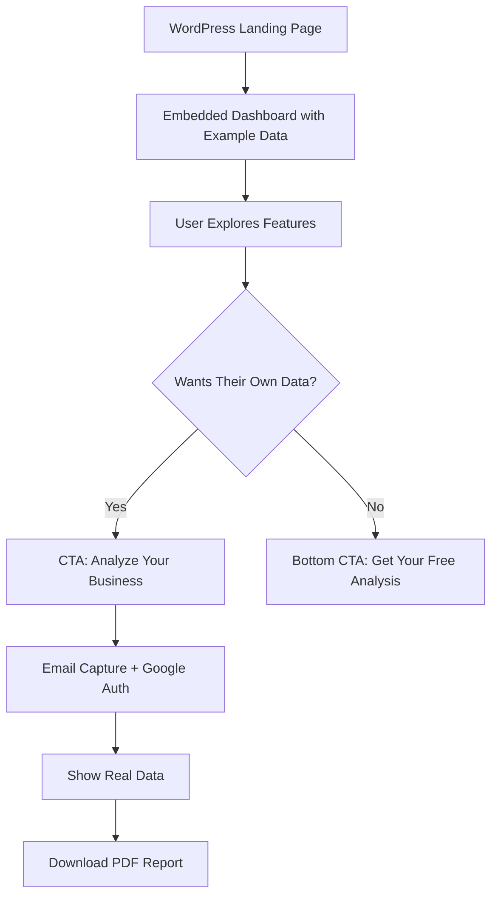

# Google Business Optimizer - Revised Lead Generation Plan

## Core Strategy: "Show Value First"
Display a fully functional dashboard with example data immediately, then offer personalized analysis after email capture.

## User Flow



## Implementation Approach

### Phase 1: Example Data Dashboard
**Goal:** Show full value immediately with compelling example data

```typescript
// src/app/(embed)/google-business-optimizer/page.tsx
export default function GoogleBusinessOptimizerEmbed() {
  const [dataMode, setDataMode] = useState<'example' | 'real'>('example');
  const [userEmail, setUserEmail] = useState<string | null>(null);
  const [realData, setRealData] = useState(null);

  return (
    <div className="min-h-screen bg-gradient-to-b from-gray-50 to-white">
      {/* Top CTA Banner */}
      <div className="bg-slate-blue text-white p-6 text-center sticky top-0 z-50 shadow-lg">
        <h2 className="text-2xl font-bold mb-2">
          Viewing Example Business Dashboard
        </h2>
        <p className="mb-4">
          See how your Google Business Profile could be performing
        </p>
        <button
          onClick={() => setShowEmailCapture(true)}
          className="bg-white text-slate-blue px-8 py-3 rounded-full font-semibold hover:bg-gray-100 transition"
        >
          🎯 Analyze Your Business Free →
        </button>
      </div>

      {/* Dashboard Components with Example Data */}
      <div className="max-w-7xl mx-auto p-6">
        <ExampleBusinessHeader />

        <div className="space-y-6">
          <OverviewStats
            {...exampleData.stats}
            showExampleBadge={true}
          />

          <BusinessHealthMetrics
            {...exampleData.health}
            showExampleBadge={true}
          />

          <OptimizationOpportunities
            opportunities={exampleData.opportunities}
            showUpgradePrompts={true}
          />
        </div>
      </div>

      {/* Bottom CTA */}
      <div className="bg-gradient-to-r from-slate-blue to-blue-600 text-white p-12 text-center">
        <h2 className="text-3xl font-bold mb-4">
          Ready to See Your Real Performance?
        </h2>
        <p className="text-xl mb-8 max-w-2xl mx-auto">
          Get your personalized Google Business Profile analysis with
          actionable insights to improve your online presence
        </p>
        <button
          onClick={() => setShowEmailCapture(true)}
          className="bg-white text-slate-blue px-10 py-4 rounded-full font-bold text-lg hover:bg-gray-100 transition transform hover:scale-105"
        >
          Get My Free Analysis →
        </button>
        <p className="text-sm mt-4 opacity-75">
          No credit card required • 60-second setup • Instant results
        </p>
      </div>

      {/* Email Capture Modal */}
      {showEmailCapture && (
        <EmailCaptureModal onSuccess={handleEmailCapture} />
      )}
    </div>
  );
}
```

### Phase 2: Example Data Configuration

```typescript
// src/data/exampleBusinessData.ts
export const exampleData = {
  business: {
    name: "Sarah's Boutique Bakery",
    location: "Downtown Seattle",
    category: "Bakery",
    imageUrl: "/images/example-bakery.jpg"
  },

  stats: {
    totalReviews: 247,
    reviewTrend: 23, // +23% this month
    averageRating: 4.7,
    monthlyReviewData: [
      { month: 'Jan', fiveStar: 12, fourStar: 3, threeStar: 1, twoStar: 0, oneStar: 0 },
      { month: 'Feb', fiveStar: 18, fourStar: 4, threeStar: 2, twoStar: 1, oneStar: 0 },
      // ... realistic data
    ]
  },

  health: {
    profileData: {
      completeness: 78,
      photosCount: 34,
      categoriesUsed: 2,
      maxCategories: 9,
      servicesCount: 6,
      businessDescriptionLength: 450,
      seoScore: 6
    },
    engagementData: {
      unrespondedReviews: 8,
      totalReviews: 247,
      recentPosts: 2,
      recentPhotos: 5,
      lastPostDate: '3 days ago'
    }
  },

  opportunities: [
    {
      id: 1,
      priority: 'high',
      title: '8 Unresponded Reviews',
      description: 'Responding to reviews improves customer trust and Google ranking',
      potentialImpact: '+15% visibility'
    },
    {
      id: 2,
      priority: 'medium',
      title: 'Add 7 More Service Categories',
      description: 'Using all available categories increases search appearances',
      potentialImpact: '+25% in relevant searches'
    }
    // ... more realistic opportunities
  ]
};
```

### Phase 3: Mailerlite Integration

```typescript
// src/lib/mailerlite.ts
import MailerLite from '@mailerlite/mailerlite-nodejs';

const mailerlite = new MailerLite({
  api_key: process.env.MAILERLITE_API_KEY!
});

export async function addToMailerlite(data: {
  email: string;
  businessName?: string;
  source: string;
  metrics?: any;
}) {
  try {
    // Create/update subscriber
    const subscriber = await mailerlite.subscribers.createOrUpdate({
      email: data.email,
      fields: {
        business_name: data.businessName,
        source: data.source,
        signup_date: new Date().toISOString(),
        total_reviews: data.metrics?.totalReviews,
        average_rating: data.metrics?.averageRating,
        optimization_score: data.metrics?.optimizationScore
      },
      groups: ['gbp-optimizer-leads'],
      status: 'active'
    });

    // Trigger automation/campaign
    await mailerlite.automations.trigger('gbp-welcome-series', {
      email: data.email
    });

    return subscriber;
  } catch (error) {
    console.error('Mailerlite error:', error);
    throw error;
  }
}
```

### Phase 4: Email Capture Modal with Google Auth

```typescript
// src/components/embed/EmailCaptureModal.tsx
export function EmailCaptureModal({ onSuccess }) {
  const [step, setStep] = useState<'email' | 'auth' | 'loading'>('email');
  const [email, setEmail] = useState('');

  const handleEmailSubmit = async (e) => {
    e.preventDefault();

    // Save email to Mailerlite immediately
    await addToMailerlite({
      email,
      source: 'gbp-optimizer',
      metrics: exampleData.stats // Include example metrics for segmentation
    });

    // Move to Google auth
    setStep('auth');
  };

  const handleGoogleAuth = () => {
    // Open Google OAuth in popup
    const authWindow = window.open(
      '/api/embed/auth/google?email=' + encodeURIComponent(email),
      'google-auth',
      'width=500,height=600'
    );

    // Listen for auth completion
    window.addEventListener('message', async (event) => {
      if (event.data.type === 'auth-success') {
        authWindow?.close();
        setStep('loading');

        // Fetch real data
        const data = await fetchRealBusinessData(event.data.token);

        // Update Mailerlite with real business info
        await updateMailerliteSubscriber(email, {
          businessName: data.businessName,
          realMetrics: data.metrics
        });

        onSuccess(data);
      }
    });
  };

  return (
    <div className="fixed inset-0 bg-black bg-opacity-50 flex items-center justify-center z-50">
      <div className="bg-white rounded-2xl p-8 max-w-md w-full">
        {step === 'email' && (
          <>
            <h3 className="text-2xl font-bold mb-4">
              Get Your Free Business Analysis
            </h3>
            <p className="text-gray-600 mb-6">
              Enter your email to analyze your Google Business Profile and get personalized recommendations
            </p>
            <form onSubmit={handleEmailSubmit}>
              <input
                type="email"
                value={email}
                onChange={(e) => setEmail(e.target.value)}
                placeholder="your@email.com"
                className="w-full p-3 border rounded-lg mb-4"
                required
              />
              <button
                type="submit"
                className="w-full bg-slate-blue text-white py-3 rounded-lg font-semibold"
              >
                Continue →
              </button>
            </form>
            <p className="text-xs text-gray-500 mt-4">
              We'll send you a copy of your report. No spam, unsubscribe anytime.
            </p>
          </>
        )}

        {step === 'auth' && (
          <>
            <h3 className="text-2xl font-bold mb-4">
              Connect Your Google Business Profile
            </h3>
            <p className="text-gray-600 mb-6">
              We need read-only access to analyze your profile and provide recommendations
            </p>
            <button
              onClick={handleGoogleAuth}
              className="w-full bg-white border-2 border-gray-300 py-3 rounded-lg font-semibold flex items-center justify-center hover:bg-gray-50"
            >
              
              Connect Google Business
            </button>
            <p className="text-xs text-gray-500 mt-4">
              Your data is secure and never shared. Read-only access only.
            </p>
          </>
        )}

        {step === 'loading' && (
          <div className="text-center">
            <div className="animate-spin rounded-full h-12 w-12 border-b-2 border-slate-blue mx-auto mb-4"></div>
            <p>Analyzing your business profile...</p>
          </div>
        )}
      </div>
    </div>
  );
}
```

### Phase 5: Visual Indicators for Example vs Real Data

```typescript
// src/components/shared/ExampleDataBadge.tsx
export function ExampleDataBadge() {
  return (
    <div className="inline-flex items-center px-3 py-1 bg-yellow-100 text-yellow-800 text-sm rounded-full">
      <span className="mr-1">👁️</span>
      Example Data
    </div>
  );
}

// Add to each component
export function OverviewStats({ showExampleBadge, ...props }) {
  return (
    <div className="bg-white rounded-lg p-6 relative">
      {showExampleBadge && (
        <div className="absolute top-4 right-4">
          <ExampleDataBadge />
        </div>
      )}
      {/* Rest of component */}
    </div>
  );
}
```

### Phase 6: WordPress Embed Code

```html
<!-- WordPress Page: https://promptreviews.com/google-business-optimizer -->
<div class="optimizer-embed-container">
  <iframe
    src="https://app.promptreviews.app/embed/google-business-optimizer"
    style="width: 100%; height: 2400px; border: none;"
    id="gbp-optimizer-frame">
  </iframe>
</div>

<script>
// Auto-resize iframe based on content
window.addEventListener('message', function(e) {
  if (e.origin !== 'https://app.promptreviews.app') return;

  if (e.data.type === 'resize') {
    document.getElementById('gbp-optimizer-frame').style.height =
      e.data.height + 'px';
  }
});
</script>
```

## Benefits of This Approach

1. **Immediate Value** - Users see exactly what they'll get
2. **Lower Friction** - Explore before committing
3. **Higher Conversion** - They're already engaged when they give email
4. **Better Segmentation** - You know what features they explored
5. **Natural Flow** - "This is cool, let me see mine" moment

## Tracking & Analytics

```typescript
// Track user journey through example data
analytics.track('example_dashboard_viewed');
analytics.track('example_metric_clicked', { metric: 'optimization_opportunities' });
analytics.track('cta_clicked', { position: 'top' | 'bottom' });
analytics.track('email_submitted');
analytics.track('google_auth_completed');
analytics.track('real_data_loaded');
```

## Multi-Tenant Support for Multiple Businesses

### Use Cases:
1. **PromptReviews.app** - Lead gen for SaaS product
2. **Your Consulting Site** - Lead gen for consulting services

### Enhanced Database Schema with Multi-Tenant Support

### New Table: `optimizer_leads`

```sql
-- migrations/[timestamp]_create_optimizer_leads_table.sql
CREATE TABLE optimizer_leads (
  -- Primary identification
  id UUID DEFAULT uuid_generate_v4() PRIMARY KEY,
  email VARCHAR(255) NOT NULL,
  created_at TIMESTAMP DEFAULT NOW(),
  updated_at TIMESTAMP DEFAULT NOW(),

  -- Multi-tenant fields
  source_business VARCHAR(100) NOT NULL, -- 'promptreviews' or 'consulting'
  source_domain VARCHAR(255), -- 'promptreviews.app' or 'yourconsulting.com'
  embed_location VARCHAR(255), -- Specific page where embedded

  -- Google Business Data
  google_account_email VARCHAR(255),
  business_name VARCHAR(255),
  google_maps_url TEXT,
  review_url TEXT, -- Direct link to leave a review
  place_id VARCHAR(255), -- Google Maps Place ID

  -- Business Details
  category VARCHAR(255),
  website_url TEXT,
  phone VARCHAR(50),
  city VARCHAR(100),
  state VARCHAR(50),
  country VARCHAR(2),
  description TEXT,

  -- Metrics Snapshot (at time of capture)
  total_reviews INTEGER,
  average_rating DECIMAL(2,1),
  monthly_searches INTEGER,
  monthly_views INTEGER,
  monthly_actions INTEGER,

  -- Engagement Indicators
  responds_to_reviews BOOLEAN,
  last_post_date TIMESTAMP,
  photos_count INTEGER,

  -- Profile Completeness
  has_website BOOLEAN,
  has_description BOOLEAN,
  has_hours BOOLEAN,
  category_count INTEGER,

  -- Lead Scoring
  lead_score INTEGER,
  lead_segment VARCHAR(50), -- 'high-value', 'medium-value', 'low-value'
  business_size VARCHAR(50), -- 'small', 'medium', 'large'
  engagement_level VARCHAR(50), -- 'low', 'medium', 'high'
  opportunity_count INTEGER,

  -- Full data snapshot for historical reference
  full_metrics_snapshot JSONB,

  -- Marketing Attribution
  utm_source VARCHAR(100),
  utm_medium VARCHAR(100),
  utm_campaign VARCHAR(100),
  referrer_url TEXT,

  -- Mailerlite Integration
  mailerlite_subscriber_id VARCHAR(255),
  mailerlite_groups TEXT[], -- Array of group IDs

  -- Lifecycle Tracking
  last_analysis_date TIMESTAMP,
  pdf_downloaded BOOLEAN DEFAULT FALSE,
  pdf_download_date TIMESTAMP,

  -- Conversion Tracking
  signed_up_for_trial BOOLEAN DEFAULT FALSE,
  trial_start_date TIMESTAMP,
  converted_to_customer BOOLEAN DEFAULT FALSE,
  customer_conversion_date TIMESTAMP,

  -- Indexes for performance
  CONSTRAINT unique_email_per_business UNIQUE(email, place_id)
);

-- Indexes for querying
CREATE INDEX idx_optimizer_leads_email ON optimizer_leads(email);
CREATE INDEX idx_optimizer_leads_created_at ON optimizer_leads(created_at DESC);
CREATE INDEX idx_optimizer_leads_lead_segment ON optimizer_leads(lead_segment);
CREATE INDEX idx_optimizer_leads_business_size ON optimizer_leads(business_size);
CREATE INDEX idx_optimizer_leads_google_account ON optimizer_leads(google_account_email);
CREATE INDEX idx_optimizer_leads_place_id ON optimizer_leads(place_id);
CREATE INDEX idx_optimizer_leads_conversion ON optimizer_leads(converted_to_customer, signed_up_for_trial);
```

### New Table: `optimizer_sessions`
For temporary session management without creating full accounts:

```sql
-- migrations/[timestamp]_create_optimizer_sessions_table.sql
CREATE TABLE optimizer_sessions (
  id UUID DEFAULT uuid_generate_v4() PRIMARY KEY,
  session_token VARCHAR(255) UNIQUE NOT NULL,

  -- Google OAuth tokens (encrypted)
  google_access_token TEXT,
  google_refresh_token TEXT,
  google_token_expires_at TIMESTAMP,

  -- Session data
  email VARCHAR(255),
  lead_id UUID REFERENCES optimizer_leads(id),

  -- Expiration
  created_at TIMESTAMP DEFAULT NOW(),
  expires_at TIMESTAMP NOT NULL DEFAULT (NOW() + INTERVAL '1 hour'),

  -- Usage tracking
  api_calls_count INTEGER DEFAULT 0,
  last_api_call_at TIMESTAMP
);

-- Auto-delete expired sessions
CREATE INDEX idx_optimizer_sessions_expires_at ON optimizer_sessions(expires_at);
```

### RLS Policies

```sql
-- Enable RLS
ALTER TABLE optimizer_leads ENABLE ROW LEVEL SECURITY;
ALTER TABLE optimizer_sessions ENABLE ROW LEVEL SECURITY;

-- Policies for optimizer_leads
-- Only service role can insert/update/delete
CREATE POLICY "Service role full access" ON optimizer_leads
  FOR ALL USING (auth.role() = 'service_role');

-- Public can read their own lead data with valid session
CREATE POLICY "Read own lead data with session" ON optimizer_leads
  FOR SELECT USING (
    email IN (
      SELECT email FROM optimizer_sessions
      WHERE session_token = current_setting('request.header.x-session-token', true)
      AND expires_at > NOW()
    )
  );

-- Policies for optimizer_sessions
-- Only service role can manage sessions
CREATE POLICY "Service role manages sessions" ON optimizer_sessions
  FOR ALL USING (auth.role() = 'service_role');
```

## Data Flow Architecture with Database

```mermaid
graph TD
    A[User Enters Email] --> B[Create optimizer_leads record]
    B --> C[Send to Mailerlite]
    C --> D[User Authenticates with Google]
    D --> E[Create optimizer_sessions record]
    E --> F[Fetch Google Business Data]
    F --> G[Update optimizer_leads with full data]
    G --> H[Display Real Dashboard]
    H --> I{Download PDF?}
    I --> J[Update pdf_downloaded flag]

    K[Session Expires 1hr] --> L[Delete session record]

    M[User Returns Later] --> N[Check existing lead by email]
    N --> O[Show "Welcome Back" flow]
```

## Benefits of This Database Design

1. **Lead Tracking Without Accounts**
   - No need to create full user accounts
   - Still track conversion journey
   - Can merge with real account if they sign up

2. **Rich Data for Sales/Marketing**
   - All Google Business data captured
   - Lead scoring built-in
   - Conversion tracking

3. **Session Management**
   - Temporary access without permanent storage
   - Auto-expiring tokens
   - Rate limiting built-in

4. **Analytics Queries**
   ```sql
   -- High-value leads not converted
   SELECT * FROM optimizer_leads
   WHERE lead_segment = 'high-value'
   AND converted_to_customer = FALSE
   AND created_at > NOW() - INTERVAL '30 days';

   -- Conversion rate by business size
   SELECT business_size,
          COUNT(*) as total_leads,
          SUM(CASE WHEN converted_to_customer THEN 1 ELSE 0 END) as converted,
          AVG(lead_score) as avg_score
   FROM optimizer_leads
   GROUP BY business_size;

   -- Engagement patterns
   SELECT category,
          AVG(total_reviews) as avg_reviews,
          AVG(average_rating) as avg_rating,
          COUNT(*) as businesses
   FROM optimizer_leads
   GROUP BY category
   ORDER BY businesses DESC;
   ```

## Implementation Tasks for Database

1. **Create Migration Files**
   - optimizer_leads table
   - optimizer_sessions table
   - RLS policies
   - Cleanup triggers

2. **Create Service Functions**
   ```typescript
   // src/lib/services/optimizerLeadService.ts
   - createLead(email, utmParams)
   - updateLeadWithGoogleData(leadId, googleData)
   - calculateAndUpdateLeadScore(leadId)
   - createSession(leadId, googleTokens)
   - validateSession(sessionToken)
   ```

3. **Add Prisma Models**
   ```prisma
   model OptimizerLead {
     id                    String   @id @default(uuid())
     email                 String
     businessName          String?
     googleMapsUrl         String?
     // ... all fields
   }
   ```

4. **Create API Endpoints**
   - POST `/api/embed/lead/create`
   - PUT `/api/embed/lead/update`
   - GET `/api/embed/lead/metrics`
   - POST `/api/embed/session/create`

## Questions Before Implementation

1. **Data Retention**: How long should we keep lead data?
   - 90 days for non-converted?
   - Forever for converted?

2. **Session Duration**: Is 1 hour enough for analysis session?
   - Could extend to 2-3 hours?
   - Or save progress and allow return?

3. **Multiple Businesses**: If someone has multiple GMB locations:
   - Create separate lead for each?
   - Or link all to one lead?

4. **GDPR Compliance**:
   - Need consent checkboxes?
   - Data deletion requests?
   - Export capabilities?

## Next Steps

1. Create compelling example data that represents an "average" business
2. Design database migration files
3. Build the capture and scoring system
4. Set up Mailerlite integration with rich fields
5. Implement session management
6. Create the embed interface
7. Add tracking and analytics

## Multi-Tenant Implementation Strategy

### 1. Embed Configuration
Each website passes different configuration:

```html
<!-- On promptreviews.app -->
<div id="gbp-optimizer-embed"
     data-source="promptreviews"
     data-campaign="saas-lead-gen"
     data-cta-text="Start Your Free Trial"
     data-follow-up="product-demo">
</div>

<!-- On your consulting site -->
<div id="gbp-optimizer-embed"
     data-source="consulting"
     data-campaign="consulting-services"
     data-cta-text="Book a Consultation"
     data-follow-up="calendar-booking">
</div>
```

### 2. Dynamic CTA and Messaging

```typescript
// src/app/(embed)/google-business-optimizer/page.tsx
const CONFIG = {
  promptreviews: {
    headline: "See How PromptReviews Can Automate Your Review Management",
    subheadline: "Join 500+ businesses improving their online reputation",
    ctaText: "Start Your Free Trial",
    ctaAction: "redirect_to_signup",
    followUp: {
      type: "product_demo",
      message: "Thanks! We'll show you how to automate review responses"
    },
    benefits: [
      "Automated review responses",
      "Multi-location management",
      "Team collaboration"
    ]
  },

  consulting: {
    headline: "Get Expert Help Optimizing Your Google Business Profile",
    subheadline: "I've helped 200+ businesses increase their local visibility",
    ctaText: "Book Your Free Consultation",
    ctaAction: "calendar_booking",
    followUp: {
      type: "consultation",
      message: "Thanks! I'll review your profile and send personalized recommendations"
    },
    benefits: [
      "1-on-1 expert guidance",
      "Custom optimization strategy",
      "Hands-on implementation help"
    ]
  }
};
```

### 3. Mailerlite Segmentation by Source

```typescript
// Different groups and automations per source
const MAILERLITE_CONFIG = {
  promptreviews: {
    groups: ['gbp-optimizer-leads', 'saas-prospects'],
    automation: 'saas-nurture-sequence',
    customFields: {
      lead_type: 'saas_prospect',
      product_interest: 'review_management'
    }
  },

  consulting: {
    groups: ['consulting-leads', 'gbp-optimization-interest'],
    automation: 'consulting-nurture-sequence',
    customFields: {
      lead_type: 'consulting_prospect',
      service_interest: 'gbp_optimization'
    }
  }
};
```

### 4. Lead Routing and Follow-up

```typescript
// src/lib/services/leadRoutingService.ts
export async function routeLead(lead: OptimizerLead) {
  switch(lead.source_business) {
    case 'promptreviews':
      // Send to CRM as product lead
      await sendToHubspot(lead, 'product_trial');

      // Schedule product demo email
      await scheduleEmail(lead.email, 'product_demo', { delay: '1 hour' });

      // Add to retargeting audience
      await addToAudience(lead.email, 'saas_trial_prospects');
      break;

    case 'consulting':
      // Send notification to you personally
      await notifyConsultant(lead);

      // Add to calendar booking flow
      await sendCalendlyLink(lead.email);

      // Send personalized video analysis
      await schedulePersonalizedAnalysis(lead);
      break;
  }
}
```

### 5. Analytics and Attribution

```typescript
// Track differently per source
const ANALYTICS_EVENTS = {
  promptreviews: {
    namespace: 'saas',
    goals: {
      primary: 'trial_signup',
      secondary: 'demo_request'
    },
    value: {
      email_captured: 10,
      analysis_completed: 25,
      trial_started: 100
    }
  },

  consulting: {
    namespace: 'consulting',
    goals: {
      primary: 'consultation_booked',
      secondary: 'proposal_requested'
    },
    value: {
      email_captured: 50,
      analysis_completed: 100,
      consultation_booked: 500
    }
  }
};
```

### 6. Reporting Dashboard

```sql
-- Query leads by source
SELECT
  source_business,
  COUNT(*) as total_leads,
  COUNT(CASE WHEN pdf_downloaded THEN 1 END) as engaged_leads,
  COUNT(CASE WHEN converted_to_customer THEN 1 END) as converted,
  AVG(lead_score) as avg_quality_score,
  AVG(total_reviews) as avg_business_size
FROM optimizer_leads
WHERE created_at > NOW() - INTERVAL '30 days'
GROUP BY source_business;

-- Conversion paths by source
SELECT
  source_business,
  source_domain,
  utm_campaign,
  COUNT(*) as leads,
  AVG(EXTRACT(EPOCH FROM (converted_at - created_at))/3600) as hours_to_convert
FROM optimizer_leads
WHERE converted_to_customer = TRUE
GROUP BY source_business, source_domain, utm_campaign;
```

### Benefits of Multi-Tenant Approach

1. **Single Tool, Multiple Uses**
   - Maintain one codebase
   - Reuse all optimizations
   - Consistent experience

2. **Better Attribution**
   - Know which business drives conversions
   - Optimize messaging per audience
   - Track ROI separately

3. **Personalized Follow-up**
   - SaaS leads → Product demo
   - Consulting leads → Personal consultation
   - Different email sequences

4. **Flexible Monetization**
   - PromptReviews → Free trial → Subscription
   - Consulting → Free analysis → Paid engagement

Should we proceed with creating the database migrations first, or would you like to refine any aspect of this plan?