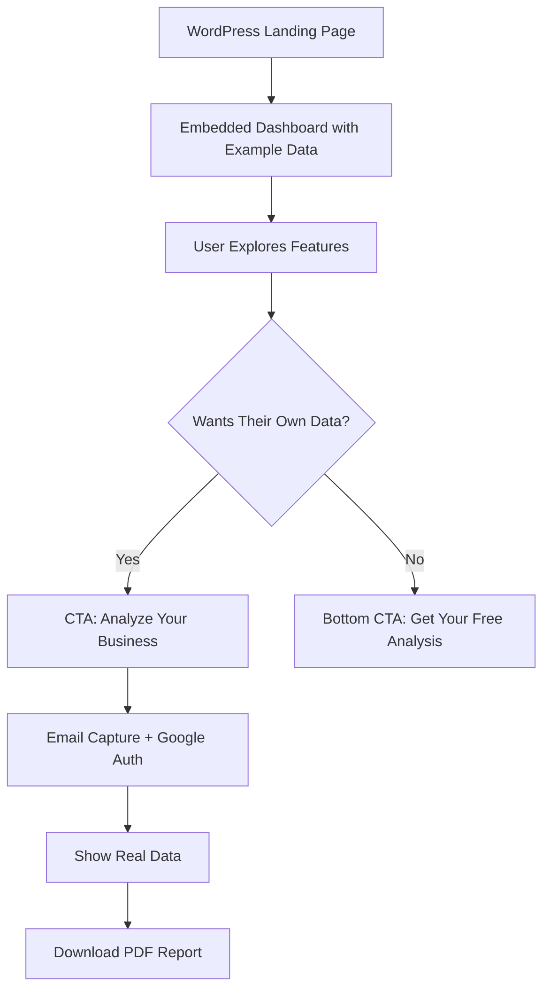

# Google Biz Optimizer™ - Revised Lead Generation Plan

## Branding & Positioning
- **Tool Name:** Google Biz Optimizer™
- **Tagline:** "Optimize Your Google Business Profile in Minutes"
- **Value Prop:** "See exactly how to improve your Google Business Profile visibility and attract more customers"
- **URL:** promptreviews.app/google-biz-optimizer
- **Embed:** app.promptreviews.app/embed/google-biz-optimizer

## Core Strategy: "Show Value First"
Display a fully functional dashboard with example data immediately, then offer personalized analysis after email capture.

## User Flow



## Implementation Approach

### Phase 1: Example Data Dashboard
**Goal:** Show full value immediately with compelling example data

```typescript
// src/app/(embed)/google-business-optimizer/page.tsx
export default function GoogleBusinessOptimizerEmbed() {
  const [dataMode, setDataMode] = useState<'example' | 'real'>('example');
  const [userEmail, setUserEmail] = useState<string | null>(null);
  const [realData, setRealData] = useState(null);

  return (
    <div className="min-h-screen bg-gradient-to-b from-gray-50 to-white">
      {/* Top CTA Banner */}
      <div className="bg-slate-blue text-white p-6 text-center sticky top-0 z-50 shadow-lg">
        <h2 className="text-2xl font-bold mb-2">
          Viewing Example Business Dashboard
        </h2>
        <p className="mb-4">
          See how your Google Business Profile could be performing
        </p>
        <button
          onClick={() => setShowEmailCapture(true)}
          className="bg-white text-slate-blue px-8 py-3 rounded-full font-semibold hover:bg-gray-100 transition"
        >
          🎯 Analyze Your Business Free →
        </button>
      </div>

      {/* Dashboard Components with Example Data */}
      <div className="max-w-7xl mx-auto p-6">
        <ExampleBusinessHeader />

        <div className="space-y-6">
          <OverviewStats
            {...exampleData.stats}
            showExampleBadge={true}
          />

          <BusinessHealthMetrics
            {...exampleData.health}
            showExampleBadge={true}
          />

          <OptimizationOpportunities
            opportunities={exampleData.opportunities}
            showUpgradePrompts={true}
          />
        </div>
      </div>

      {/* Bottom CTA */}
      <div className="bg-gradient-to-r from-slate-blue to-blue-600 text-white p-12 text-center">
        <h2 className="text-3xl font-bold mb-4">
          Ready to See Your Real Performance?
        </h2>
        <p className="text-xl mb-8 max-w-2xl mx-auto">
          Get your personalized Google Business Profile analysis with
          actionable insights to improve your online presence
        </p>
        <button
          onClick={() => setShowEmailCapture(true)}
          className="bg-white text-slate-blue px-10 py-4 rounded-full font-bold text-lg hover:bg-gray-100 transition transform hover:scale-105"
        >
          Get My Free Analysis →
        </button>
        <p className="text-sm mt-4 opacity-75">
          No credit card required • 60-second setup • Instant results
        </p>
      </div>

      {/* Email Capture Modal */}
      {showEmailCapture && (
        <EmailCaptureModal onSuccess={handleEmailCapture} />
      )}
    </div>
  );
}
```

### Phase 2: Example Data Configuration

```typescript
// src/data/exampleBusinessData.ts
export const exampleData = {
  business: {
    name: "Sarah's Boutique Bakery",
    location: "Downtown Seattle",
    category: "Bakery",
    imageUrl: "/images/example-bakery.jpg"
  },

  stats: {
    totalReviews: 247,
    reviewTrend: 23, // +23% this month
    averageRating: 4.7,
    monthlyReviewData: [
      { month: 'Jan', fiveStar: 12, fourStar: 3, threeStar: 1, twoStar: 0, oneStar: 0 },
      { month: 'Feb', fiveStar: 18, fourStar: 4, threeStar: 2, twoStar: 1, oneStar: 0 },
      // ... realistic data
    ]
  },

  health: {
    profileData: {
      completeness: 78,
      photosCount: 34,
      categoriesUsed: 2,
      maxCategories: 9,
      servicesCount: 6,
      businessDescriptionLength: 450,
      seoScore: 6
    },
    engagementData: {
      unrespondedReviews: 8,
      totalReviews: 247,
      recentPosts: 2,
      recentPhotos: 5,
      lastPostDate: '3 days ago'
    }
  },

  opportunities: [
    {
      id: 1,
      priority: 'high',
      title: '8 Unresponded Reviews',
      description: 'Responding to reviews improves customer trust and Google ranking',
      potentialImpact: '+15% visibility'
    },
    {
      id: 2,
      priority: 'medium',
      title: 'Add 7 More Service Categories',
      description: 'Using all available categories increases search appearances',
      potentialImpact: '+25% in relevant searches'
    }
    // ... more realistic opportunities
  ]
};
```

### Phase 3: Mailerlite Integration

```typescript
// src/lib/mailerlite.ts
import MailerLite from '@mailerlite/mailerlite-nodejs';

const mailerlite = new MailerLite({
  api_key: process.env.MAILERLITE_API_KEY!
});

export async function addToMailerlite(data: {
  email: string;
  businessName?: string;
  source: string;
  metrics?: any;
}) {
  try {
    // Create/update subscriber
    const subscriber = await mailerlite.subscribers.createOrUpdate({
      email: data.email,
      fields: {
        business_name: data.businessName,
        source: data.source,
        signup_date: new Date().toISOString(),
        total_reviews: data.metrics?.totalReviews,
        average_rating: data.metrics?.averageRating,
        optimization_score: data.metrics?.optimizationScore
      },
      groups: ['gbp-optimizer-leads'],
      status: 'active'
    });

    // Trigger automation/campaign
    await mailerlite.automations.trigger('gbp-welcome-series', {
      email: data.email
    });

    return subscriber;
  } catch (error) {
    console.error('Mailerlite error:', error);
    throw error;
  }
}
```

### Phase 4: Email Capture Modal with Google Auth

```typescript
// src/components/embed/EmailCaptureModal.tsx
export function EmailCaptureModal({ onSuccess }) {
  const [step, setStep] = useState<'email' | 'auth' | 'loading'>('email');
  const [email, setEmail] = useState('');

  const handleEmailSubmit = async (e) => {
    e.preventDefault();

    // Save email to Mailerlite immediately
    await addToMailerlite({
      email,
      source: 'gbp-optimizer',
      metrics: exampleData.stats // Include example metrics for segmentation
    });

    // Move to Google auth
    setStep('auth');
  };

  const handleGoogleAuth = () => {
    // Open Google OAuth in popup
    const authWindow = window.open(
      '/api/embed/auth/google?email=' + encodeURIComponent(email),
      'google-auth',
      'width=500,height=600'
    );

    // Listen for auth completion
    window.addEventListener('message', async (event) => {
      if (event.data.type === 'auth-success') {
        authWindow?.close();
        setStep('loading');

        // Fetch real data
        const data = await fetchRealBusinessData(event.data.token);

        // Update Mailerlite with real business info
        await updateMailerliteSubscriber(email, {
          businessName: data.businessName,
          realMetrics: data.metrics
        });

        onSuccess(data);
      }
    });
  };

  return (
    <div className="fixed inset-0 bg-black bg-opacity-50 flex items-center justify-center z-50">
      <div className="bg-white rounded-2xl p-8 max-w-md w-full">
        {step === 'email' && (
          <>
            <h3 className="text-2xl font-bold mb-4">
              Get Your Free Business Analysis
            </h3>
            <p className="text-gray-600 mb-6">
              Enter your email to analyze your Google Business Profile and get personalized recommendations
            </p>
            <form onSubmit={handleEmailSubmit}>
              <input
                type="email"
                value={email}
                onChange={(e) => setEmail(e.target.value)}
                placeholder="your@email.com"
                className="w-full p-3 border rounded-lg mb-4"
                required
              />
              <button
                type="submit"
                className="w-full bg-slate-blue text-white py-3 rounded-lg font-semibold"
              >
                Continue →
              </button>
            </form>
            <p className="text-xs text-gray-500 mt-4">
              We'll send you a copy of your report. No spam, unsubscribe anytime.
            </p>
          </>
        )}

        {step === 'auth' && (
          <>
            <h3 className="text-2xl font-bold mb-4">
              Connect Your Google Business Profile
            </h3>
            <p className="text-gray-600 mb-6">
              We need read-only access to analyze your profile and provide recommendations
            </p>
            <button
              onClick={handleGoogleAuth}
              className="w-full bg-white border-2 border-gray-300 py-3 rounded-lg font-semibold flex items-center justify-center hover:bg-gray-50"
            >
              
              Connect Google Business
            </button>
            <p className="text-xs text-gray-500 mt-4">
              Your data is secure and never shared. Read-only access only.
            </p>
          </>
        )}

        {step === 'loading' && (
          <div className="text-center">
            <div className="animate-spin rounded-full h-12 w-12 border-b-2 border-slate-blue mx-auto mb-4"></div>
            <p>Analyzing your business profile...</p>
          </div>
        )}
      </div>
    </div>
  );
}
```

### Phase 5: Visual Indicators for Example vs Real Data

```typescript
// src/components/shared/ExampleDataBadge.tsx
export function ExampleDataBadge() {
  return (
    <div className="inline-flex items-center px-3 py-1 bg-yellow-100 text-yellow-800 text-sm rounded-full">
      <span className="mr-1">👁️</span>
      Example Data
    </div>
  );
}

// Add to each component
export function OverviewStats({ showExampleBadge, ...props }) {
  return (
    <div className="bg-white rounded-lg p-6 relative">
      {showExampleBadge && (
        <div className="absolute top-4 right-4">
          <ExampleDataBadge />
        </div>
      )}
      {/* Rest of component */}
    </div>
  );
}
```

### Phase 6: WordPress Embed Code

```html
<!-- WordPress Page: https://promptreviews.com/google-business-optimizer -->
<div class="optimizer-embed-container">
  <iframe
    src="https://app.promptreviews.app/embed/google-business-optimizer"
    style="width: 100%; height: 2400px; border: none;"
    id="gbp-optimizer-frame">
  </iframe>
</div>

<script>
// Auto-resize iframe based on content
window.addEventListener('message', function(e) {
  if (e.origin !== 'https://app.promptreviews.app') return;

  if (e.data.type === 'resize') {
    document.getElementById('gbp-optimizer-frame').style.height =
      e.data.height + 'px';
  }
});
</script>
```

```typescript
// src/app/(embed)/google-business-optimizer/page.tsx
useEffect(() => {
  const resizeObserver = new ResizeObserver(() => {
    window.parent.postMessage(
      {
        type: 'resize',
        height: document.body.scrollHeight
      },
      'https://promptreviews.com'
    );
  });

  resizeObserver.observe(document.body);

  return () => resizeObserver.disconnect();
}, []);
```

- Throttle the observer callback to 200ms to avoid message floods.
- Keep an allowlist of parent origins (`promptreviews.com`, `promptreviews.app`) and power users can provide their own via env var.
- Expose an optional `postMessage` handler for CTA events (e.g., `cta_clicked`) so marketing sites can hook analytics.

## Widget-Specific UI Adjustments

- Remove task list arrows/links that point users to in-app execution flows; replace with static descriptors so the embed stays self-contained.
- Audit other action-oriented elements inside the dashboard and disable or relabel anything that would normally deep-link into the main app (e.g., settings shortcuts, external modals).
- Provide tooltip copy or inline text indicating those actions are available after signup, preserving the conversion narrative without broken links.
- Ensure these adjustments are scoped to the embed version via feature flags or props so the primary app retains full interactivity.

## Benefits of This Approach

1. **Immediate Value** - Users see exactly what they'll get
2. **Lower Friction** - Explore before committing
3. **Higher Conversion** - They're already engaged when they give email
4. **Better Segmentation** - You know what features they explored
5. **Natural Flow** - "This is cool, let me see mine" moment

## Tracking & Analytics

```typescript
// Track user journey through example data
analytics.track('example_dashboard_viewed');
analytics.track('example_metric_clicked', { metric: 'optimization_opportunities' });
analytics.track('cta_clicked', { position: 'top' | 'bottom' });
analytics.track('email_submitted');
analytics.track('google_auth_completed');
analytics.track('real_data_loaded');
```

## Security Strategy & Compliance

**Token Handling**
- Mint short-lived (30-60 min) JWT session tokens in `/api/embed/session/create` using a dedicated `EMBED_SESSION_SECRET`.
- Return the signed token to the iframe and persist only `sha256` hashes in `optimizer_sessions` (see table schema).
- Rotate the signing secret quarterly and invalidate outstanding sessions via a stored `session_key_version`.

**Google OAuth Secrets**
- Encrypt access/refresh tokens with AES-256-GCM; store cipher text, IV, and key version in the database.
- Keep encryption keys in managed KMS (Supabase Vault or AWS KMS) and expose to the app as `ENCRYPTION_KEY` / `ENCRYPTION_KEY_VERSION` env vars.
- Implement `encryptToken`/`decryptToken` helpers under `src/lib/crypto/googleTokenCipher.ts` and mark the module `server-only` to prevent bundling client-side.

**MailerLite & Third Parties**
- Call MailerLite from API routes (Next.js Route Handlers or server actions) so secrets never reach the browser.
- Queue retries/asynchronous syncs through a server worker to avoid leaking API keys via network inspector tools.

**Iframe Hardening**
- Set `Content-Security-Policy: frame-ancestors https://promptreviews.com https://www.promptreviews.com https://promptreviews.app;` on the embed route; extend via config for partner domains.
- Provide `Permissions-Policy: interest-cohort=()` and `X-Frame-Options: ALLOW-FROM https://promptreviews.com` fallbacks for legacy browsers.
- Validate incoming `postMessage` events against the same allowlist before mutating UI or state.

**Observability & Alerts**
- Log session creation, token decrypt attempts, and Google API failures to a dedicated channel with rate limiting.
- Alert on spikes in session creation from single IPs or repeated decrypt failures to catch brute force attempts early.

**Data Lifecycle**
- Auto-expire `optimizer_sessions` after 2 hours (configurable) and wipe encrypted tokens via nightly cron.
- Purge unconverted `optimizer_leads` after 90 days unless tagged `keep_forever` for paying customers.
- Provide a GDPR erasure endpoint (`/api/embed/lead/delete`) that cascades across leads, sessions, and MailerLite records.


## Help Modal & Docs Integration

- Preserve the existing help bubble behavior: every `?` icon inside the embed must open the shared help modal component with the same article routing logic used in the main app.
- Ensure the modal fetches article content from the public docs site (`https://promptreviews.app/docs`) so updates stay in sync.
- Expose an `onHelpArticleOpen` callback (or analytics event) when the modal is triggered from the embed to track education engagement.
- Provide configuration to preload top Google Biz Optimizer articles for offline/SSR rendering while still deferring full content fetch to the docs service.
- Respect the marketing host's scroll context: the modal should trap focus and prevent background scroll even when inside an iframe.

### Help Modal Implementation Notes

```typescript
// src/components/embed/HelpBubble.tsx
export function HelpBubble({ articleId }) {
  return (
    <button
      className="help-bubble"
      onClick={() => openHelpModal({ section: 'google-biz-optimizer', articleId })}
      aria-label="Open help center"
    >
      ?
    </button>
  );
}

// src/components/embed/HelpModal.tsx reuse existing modal
// - Accepts initialArticleId
// - Loads content from docs service
// - Emits analytics event
```

- Add regression tests that mount the embed in jsdom and assert `openHelpModal` loads the expected article.
- Confirm the embed respects the parent site's dark/light theme overrides for the modal, if provided.


## Multi-Tenant Support for Multiple Businesses

### Use Cases:
1. **PromptReviews.app** - Lead gen for SaaS product
2. **Your Consulting Site** - Lead gen for consulting services

### Enhanced Database Schema with Multi-Tenant Support

### New Table: `optimizer_leads`

```sql
-- migrations/[timestamp]_create_optimizer_leads_table.sql
CREATE TABLE optimizer_leads (
  -- Primary identification
  id UUID DEFAULT uuid_generate_v4() PRIMARY KEY,
  email VARCHAR(255) NOT NULL,
  created_at TIMESTAMP DEFAULT NOW(),
  updated_at TIMESTAMP DEFAULT NOW(),

  -- Multi-tenant fields
  source_business VARCHAR(100) NOT NULL, -- 'promptreviews' or 'consulting'
  source_domain VARCHAR(255), -- 'promptreviews.app' or 'yourconsulting.com'
  embed_location VARCHAR(255), -- Specific page where embedded

  -- Google Business Data
  google_account_email VARCHAR(255),
  business_name VARCHAR(255),
  google_maps_url TEXT,
  review_url TEXT, -- Direct link to leave a review
  place_id VARCHAR(255), -- Google Maps Place ID

  -- Business Details
  category VARCHAR(255),
  website_url TEXT,
  phone VARCHAR(50),
  city VARCHAR(100),
  state VARCHAR(50),
  country VARCHAR(2),
  description TEXT,

  -- Metrics Snapshot (at time of capture)
  total_reviews INTEGER,
  average_rating DECIMAL(2,1),
  monthly_searches INTEGER,
  monthly_views INTEGER,
  monthly_actions INTEGER,

  -- Engagement Indicators
  responds_to_reviews BOOLEAN,
  last_post_date TIMESTAMP,
  photos_count INTEGER,

  -- Profile Completeness
  has_website BOOLEAN,
  has_description BOOLEAN,
  has_hours BOOLEAN,
  category_count INTEGER,

  -- Lead Scoring
  lead_score INTEGER,
  lead_segment VARCHAR(50), -- 'high-value', 'medium-value', 'low-value'
  business_size VARCHAR(50), -- 'small', 'medium', 'large'
  engagement_level VARCHAR(50), -- 'low', 'medium', 'high'
  opportunity_count INTEGER,

  -- Full data snapshot for historical reference
  full_metrics_snapshot JSONB,

  -- Marketing Attribution
  utm_source VARCHAR(100),
  utm_medium VARCHAR(100),
  utm_campaign VARCHAR(100),
  referrer_url TEXT,

  -- Mailerlite Integration
  mailerlite_subscriber_id VARCHAR(255),
  mailerlite_groups TEXT[], -- Array of group IDs

  -- Lifecycle Tracking
  last_analysis_date TIMESTAMP,
  pdf_downloaded BOOLEAN DEFAULT FALSE,
  pdf_download_date TIMESTAMP,

  -- Conversion Tracking
  signed_up_for_trial BOOLEAN DEFAULT FALSE,
  trial_start_date TIMESTAMP,
  converted_to_customer BOOLEAN DEFAULT FALSE,
  customer_conversion_date TIMESTAMP,

  -- Indexes for performance
  CONSTRAINT unique_email_per_business UNIQUE(email, place_id)
);

-- Indexes for querying
CREATE INDEX idx_optimizer_leads_email ON optimizer_leads(email);
CREATE INDEX idx_optimizer_leads_created_at ON optimizer_leads(created_at DESC);
CREATE INDEX idx_optimizer_leads_lead_segment ON optimizer_leads(lead_segment);
CREATE INDEX idx_optimizer_leads_business_size ON optimizer_leads(business_size);
CREATE INDEX idx_optimizer_leads_google_account ON optimizer_leads(google_account_email);
CREATE INDEX idx_optimizer_leads_place_id ON optimizer_leads(place_id);
CREATE INDEX idx_optimizer_leads_conversion ON optimizer_leads(converted_to_customer, signed_up_for_trial);
```

### New Table: `optimizer_sessions`
For temporary session management without creating full accounts:

```sql
-- migrations/[timestamp]_create_optimizer_sessions_table.sql
CREATE TABLE optimizer_sessions (
  id UUID DEFAULT uuid_generate_v4() PRIMARY KEY,
  session_token_hash CHAR(64) UNIQUE NOT NULL, -- SHA-256 hex digest of signed session token
  session_scope JSONB DEFAULT '{}'::jsonb,
  session_key_version VARCHAR(32) DEFAULT 'v1',

  -- Google OAuth tokens (AES-256 encrypted at rest)
  google_access_token_cipher TEXT,
  google_refresh_token_cipher TEXT,
  google_token_iv TEXT,
  google_token_key_version VARCHAR(32),
  google_token_expires_at TIMESTAMP,

  -- Session data
  email VARCHAR(255),
  lead_id UUID REFERENCES optimizer_leads(id),

  -- Expiration
  created_at TIMESTAMP DEFAULT NOW(),
  expires_at TIMESTAMP NOT NULL DEFAULT (NOW() + INTERVAL '1 hour'),

  -- Usage tracking
  api_calls_count INTEGER DEFAULT 0,
  last_api_call_at TIMESTAMP
);

-- Auto-delete expired sessions
CREATE INDEX idx_optimizer_sessions_expires_at ON optimizer_sessions(expires_at);
```

### RLS Policies

```sql
-- Enable RLS
ALTER TABLE optimizer_leads ENABLE ROW LEVEL SECURITY;
ALTER TABLE optimizer_sessions ENABLE ROW LEVEL SECURITY;

-- Policies for optimizer_leads
-- Only service role can insert/update/delete
CREATE POLICY "Service role full access" ON optimizer_leads
  FOR ALL USING (auth.role() = 'service_role');

-- Public can read their own lead data with valid session
CREATE POLICY "Read own lead data with session" ON optimizer_leads
  FOR SELECT USING (
    email IN (
      SELECT email FROM optimizer_sessions
      WHERE session_token_hash = encode(digest(current_setting('request.header.x-session-token', true), 'sha256'), 'hex')
      AND expires_at > NOW()
    )
  );

-- Policies for optimizer_sessions
-- Only service role can manage sessions
CREATE POLICY "Service role manages sessions" ON optimizer_sessions
  FOR ALL USING (auth.role() = 'service_role');
```

## Data Flow Architecture with Database

```mermaid
graph TD
    A[User Enters Email] --> B[Create optimizer_leads record]
    B --> C[Send to Mailerlite]
    C --> D[User Authenticates with Google]
    D --> E[Create optimizer_sessions record]
    E --> F[Fetch Google Business Data]
    F --> G[Update optimizer_leads with full data]
    G --> H[Display Real Dashboard]
    H --> I{Download PDF?}
    I --> J[Update pdf_downloaded flag]

    K[Session Expires 1hr] --> L[Delete session record]

    M[User Returns Later] --> N[Check existing lead by email]
    N --> O[Show "Welcome Back" flow]
```

## Benefits of This Database Design

1. **Lead Tracking Without Accounts**
   - No need to create full user accounts
   - Still track conversion journey
   - Can merge with real account if they sign up

2. **Rich Data for Sales/Marketing**
   - All Google Business data captured
   - Lead scoring built-in
   - Conversion tracking

3. **Session Management**
   - Temporary access without permanent storage
   - Auto-expiring tokens
   - Rate limiting built-in

4. **Analytics Queries**
   ```sql
   -- High-value leads not converted
   SELECT * FROM optimizer_leads
   WHERE lead_segment = 'high-value'
   AND converted_to_customer = FALSE
   AND created_at > NOW() - INTERVAL '30 days';

   -- Conversion rate by business size
   SELECT business_size,
          COUNT(*) as total_leads,
          SUM(CASE WHEN converted_to_customer THEN 1 ELSE 0 END) as converted,
          AVG(lead_score) as avg_score
   FROM optimizer_leads
   GROUP BY business_size;

   -- Engagement patterns
   SELECT category,
          AVG(total_reviews) as avg_reviews,
          AVG(average_rating) as avg_rating,
          COUNT(*) as businesses
   FROM optimizer_leads
   GROUP BY category
   ORDER BY businesses DESC;
   ```

## Implementation Tasks for Database

1. **Create Migration Files**
   - optimizer_leads table
   - optimizer_sessions table
   - RLS policies
   - `CREATE EXTENSION IF NOT EXISTS pgcrypto;` for hashing helper
   - Cleanup triggers

2. **Create Service Functions**
   ```typescript
   // src/lib/services/optimizerLeadService.ts
   - createLead(email, utmParams)
   - updateLeadWithGoogleData(leadId, googleData)
   - calculateAndUpdateLeadScore(leadId)
   - createSession(leadId, scope): returns { signedToken, sessionId }
   - validateSession(signedToken): verifies JWT + hashed token
   - rotateSessionKeys(currentVersion)
   ```

   ```typescript
   // src/lib/crypto/googleTokenCipher.ts
   - encryptToken(rawToken, keyVersion?)
   - decryptToken(cipherText, iv, keyVersion)
   - hashSessionToken(signedToken)
   ```

3. **Add Prisma Models**
   ```prisma
   model OptimizerLead {
     id                    String   @id @default(uuid())
     email                 String
     businessName          String?
     googleMapsUrl         String?
     // ... all fields
   }
   ```

4. **Create API Endpoints**
   - POST `/api/embed/lead/create`
   - PUT `/api/embed/lead/update`
   - GET `/api/embed/lead/metrics`
   - POST `/api/embed/session/create`

## Documentation Deliverables

- Draft `docs/google-biz-optimizer/embed/README.md` covering iframe setup, origin allowlist, environment variables, and security expectations.
- Update `docs/help/google-biz-optimizer/HELP_ARTICLES_INDEX.md` with a link to the embed guide once live.
- Add inline docs to API handlers (JSDoc) summarizing expected payloads for `lead` and `session` endpoints.
- Maintain a public test page (`test-embed.html`) that renders the iframe with sample configuration for manual QA.

## Questions Before Implementation

1. **Data Retention**: How long should we keep lead data?
   - 90 days for non-converted?
   - Forever for converted?

2. **Session Duration**: Is 1 hour enough for analysis session?
   - Could extend to 2-3 hours?
   - Or save progress and allow return?

3. **Multiple Businesses**: If someone has multiple GMB locations:
   - Create separate lead for each?
   - Or link all to one lead?

4. **GDPR Compliance**:
   - Need consent checkboxes?
   - Data deletion requests?
   - Export capabilities?

## Next Steps

1. Create compelling example data that represents an "average" business
2. Design database migration files
3. Build the capture and scoring system
4. Set up Mailerlite integration with rich fields
5. Implement session management
6. Create the embed interface
7. Add tracking and analytics

## Multi-Tenant Implementation Strategy

### 1. Embed Configuration
Each website passes different configuration:

```html
<!-- On promptreviews.app -->
<div id="gbp-optimizer-embed"
     data-source="promptreviews"
     data-campaign="saas-lead-gen"
     data-cta-text="Start Your Free Trial"
     data-follow-up="product-demo">
</div>

<!-- On your consulting site -->
<div id="gbp-optimizer-embed"
     data-source="consulting"
     data-campaign="consulting-services"
     data-cta-text="Book a Consultation"
     data-follow-up="calendar-booking">
</div>
```

### 2. Dynamic CTA and Messaging

```typescript
// src/app/(embed)/google-business-optimizer/page.tsx
const CONFIG = {
  promptreviews: {
    headline: "See How PromptReviews Can Automate Your Review Management",
    subheadline: "Join 500+ businesses improving their online reputation",
    ctaText: "Start Your Free Trial",
    ctaAction: "redirect_to_signup",
    followUp: {
      type: "product_demo",
      message: "Thanks! We'll show you how to automate review responses"
    },
    benefits: [
      "Automated review responses",
      "Multi-location management",
      "Team collaboration"
    ]
  },

  consulting: {
    headline: "Get Expert Help Optimizing Your Google Business Profile",
    subheadline: "I've helped 200+ businesses increase their local visibility",
    ctaText: "Book Your Free Consultation",
    ctaAction: "calendar_booking",
    followUp: {
      type: "consultation",
      message: "Thanks! I'll review your profile and send personalized recommendations"
    },
    benefits: [
      "1-on-1 expert guidance",
      "Custom optimization strategy",
      "Hands-on implementation help"
    ]
  }
};
```

### 3. Mailerlite Segmentation by Source

```typescript
// Different groups and automations per source
const MAILERLITE_CONFIG = {
  promptreviews: {
    groups: ['gbp-optimizer-leads', 'saas-prospects'],
    automation: 'saas-nurture-sequence',
    customFields: {
      lead_type: 'saas_prospect',
      product_interest: 'review_management'
    }
  },

  consulting: {
    groups: ['consulting-leads', 'gbp-optimization-interest'],
    automation: 'consulting-nurture-sequence',
    customFields: {
      lead_type: 'consulting_prospect',
      service_interest: 'gbp_optimization'
    }
  }
};
```

### 4. Lead Routing and Follow-up

```typescript
// src/lib/services/leadRoutingService.ts
export async function routeLead(lead: OptimizerLead) {
  switch(lead.source_business) {
    case 'promptreviews':
      // Send to CRM as product lead
      await sendToHubspot(lead, 'product_trial');

      // Schedule product demo email
      await scheduleEmail(lead.email, 'product_demo', { delay: '1 hour' });

      // Add to retargeting audience
      await addToAudience(lead.email, 'saas_trial_prospects');
      break;

    case 'consulting':
      // Send notification to you personally
      await notifyConsultant(lead);

      // Add to calendar booking flow
      await sendCalendlyLink(lead.email);

      // Send personalized video analysis
      await schedulePersonalizedAnalysis(lead);
      break;
  }
}
```

### 5. Analytics and Attribution

```typescript
// Track differently per source
const ANALYTICS_EVENTS = {
  promptreviews: {
    namespace: 'saas',
    goals: {
      primary: 'trial_signup',
      secondary: 'demo_request'
    },
    value: {
      email_captured: 10,
      analysis_completed: 25,
      trial_started: 100
    }
  },

  consulting: {
    namespace: 'consulting',
    goals: {
      primary: 'consultation_booked',
      secondary: 'proposal_requested'
    },
    value: {
      email_captured: 50,
      analysis_completed: 100,
      consultation_booked: 500
    }
  }
};
```

### 6. Reporting Dashboard

```sql
-- Query leads by source
SELECT
  source_business,
  COUNT(*) as total_leads,
  COUNT(CASE WHEN pdf_downloaded THEN 1 END) as engaged_leads,
  COUNT(CASE WHEN converted_to_customer THEN 1 END) as converted,
  AVG(lead_score) as avg_quality_score,
  AVG(total_reviews) as avg_business_size
FROM optimizer_leads
WHERE created_at > NOW() - INTERVAL '30 days'
GROUP BY source_business;

-- Conversion paths by source
SELECT
  source_business,
  source_domain,
  utm_campaign,
  COUNT(*) as leads,
  AVG(EXTRACT(EPOCH FROM (converted_at - created_at))/3600) as hours_to_convert
FROM optimizer_leads
WHERE converted_to_customer = TRUE
GROUP BY source_business, source_domain, utm_campaign;
```

### Benefits of Multi-Tenant Approach

1. **Single Tool, Multiple Uses**
   - Maintain one codebase
   - Reuse all optimizations
   - Consistent experience

2. **Better Attribution**
   - Know which business drives conversions
   - Optimize messaging per audience
   - Track ROI separately

3. **Personalized Follow-up**
   - SaaS leads → Product demo
   - Consulting leads → Personal consultation
   - Different email sequences

4. **Flexible Monetization**
   - PromptReviews → Free trial → Subscription
   - Consulting → Free analysis → Paid engagement

## Educational Content Strategy

### 1. Help Content Architecture

```typescript
// src/data/helpContent/googleBusinessMetrics.ts
export const HELP_ARTICLES = {
  'review-velocity': {
    id: 'review-velocity',
    title: 'Understanding Review Velocity',
    category: 'metrics',
    excerpt: 'Why the pace of new reviews matters more than total count',
    content: `
      # Review Velocity: Your Hidden Ranking Factor

      Google doesn't just look at your total reviews - they care about momentum.
      A business with 50 reviews getting 10/month often outranks one with 200 old reviews.

      ## What's a Good Velocity?
      - **Excellent**: 5+ reviews/month
      - **Good**: 2-4 reviews/month
      - **Needs Work**: <2 reviews/month

      ## How to Improve
      1. Set up automated review invitations
      2. Train staff to ask at peak satisfaction moments
      3. Make it easy with QR codes and SMS links
    `,
    relatedArticles: ['review-response-time', 'review-quality'],
    ctaText: 'Automate Review Collection',
    ctaLink: '/features/review-invitations'
  },

  'profile-completeness': {
    id: 'profile-completeness',
    title: 'Profile Completeness Score',
    category: 'optimization',
    excerpt: 'Each missing field reduces your visibility by up to 7%',
    content: `
      # Your Profile is Your Foundation

      Google confirmed: Complete profiles get 70% more clicks.

      ## Critical Fields (Must Have)
      - Business description (750 chars)
      - All available categories
      - Complete hours (including holidays)
      - Photos in each category

      ## Often Missed Opportunities
      - Service descriptions
      - Product catalogs
      - Attributes (wheelchair access, WiFi, etc.)
      - COVID-19 updates
    `,
    videoUrl: 'https://youtube.com/watch?v=...',
    relatedArticles: ['categories-strategy', 'photo-optimization']
  },

  'search-visibility': {
    id: 'search-visibility',
    title: 'Search Visibility Metrics',
    category: 'performance',
    excerpt: 'How often you appear vs competitors',
    content: `...`,
    premium: true // Some content for paid users only
  }
};
```

### 2. Inline Help System for Embed

```typescript
// src/components/embed/HelpModal.tsx
export function HelpModal({ articleId, isOpen, onClose }) {
  const article = HELP_ARTICLES[articleId];

  return (
    <Modal isOpen={isOpen} onClose={onClose}>
      <div className="max-w-2xl">
        <article className="prose">
          <h1>{article.title}</h1>
          <div dangerouslySetInnerHTML={{ __html: markdown(article.content) }} />

          {/* Lead capture opportunity */}
          {!userEmail && (
            <div className="mt-8 p-6 bg-blue-50 rounded-lg">
              <h3>Want the Full Guide?</h3>
              <p>Get our complete GMB optimization checklist</p>
              <EmailCaptureForm
                incentive="optimization-guide"
                source={currentSource}
              />
            </div>
          )}

          {/* Source-specific CTA */}
          {currentSource === 'consulting' ? (
            <button className="mt-4">
              Need help implementing this? Let's talk →
            </button>
          ) : (
            <button className="mt-4">
              Automate this with PromptReviews →
            </button>
          )}
        </article>

        {/* Related articles to increase engagement */}
        <div className="mt-8 border-t pt-8">
          <h3>Related Topics</h3>
          <div className="grid grid-cols-2 gap-4">
            {article.relatedArticles.map(id => (
              <button
                onClick={() => openArticle(id)}
                className="text-left p-4 border rounded hover:bg-gray-50"
              >
                <h4>{HELP_ARTICLES[id].title}</h4>
                <p className="text-sm text-gray-600">{HELP_ARTICLES[id].excerpt}</p>
              </button>
            ))}
          </div>
        </div>
      </div>
    </Modal>
  );
}
```

### 3. Integration with Metrics Display

```typescript
// src/components/GoogleBusinessProfile/core/OverviewStats.tsx
export function MetricDisplay({
  label,
  value,
  change,
  helpArticleId,
  showHelp = true
}) {
  return (
    <div className="relative group">
      <div className="flex items-center gap-2">
        <span className="text-sm text-gray-600">{label}</span>
        {showHelp && helpArticleId && (
          <button
            onClick={() => openHelpModal(helpArticleId)}
            className="opacity-0 group-hover:opacity-100 transition-opacity"
            aria-label={`Learn more about ${label}`}
          >
            <Icon name="FaQuestionCircle" className="w-3 h-3 text-gray-400 hover:text-blue-500" />
          </button>
        )}
      </div>
      <div className="text-2xl font-bold">{value}</div>
      {change && (
        <div className={`text-sm ${change > 0 ? 'text-green-600' : 'text-red-600'}`}>
          {change > 0 ? '+' : ''}{change}% this month
        </div>
      )}
    </div>
  );
}

// Usage in stats
<MetricDisplay
  label="Review Velocity"
  value="3.2/month"
  change={15}
  helpArticleId="review-velocity"
/>
```

### 4. SEO-Friendly Documentation Site

```typescript
// src/app/(public)/docs/[category]/[slug]/page.tsx
// These same articles become public SEO pages

export async function generateStaticParams() {
  return Object.values(HELP_ARTICLES).map(article => ({
    category: article.category,
    slug: article.id
  }));
}

export default function DocPage({ params }) {
  const article = HELP_ARTICLES[params.slug];

  return (
    <>
      {/* SEO Meta */}
      <Head>
        <title>{article.title} - Google Business Profile Guide</title>
        <meta name="description" content={article.excerpt} />
        <link rel="canonical" href={`/docs/${article.category}/${article.id}`} />
      </Head>

      {/* Content with schema markup */}
      <article itemScope itemType="https://schema.org/Article">
        <h1 itemProp="headline">{article.title}</h1>
        <div itemProp="articleBody">
          {/* Article content */}
        </div>

        {/* Lead capture for SEO traffic */}
        <div className="mt-12 p-8 bg-gradient-to-r from-blue-50 to-purple-50 rounded-xl">
          <h2>Free Google Business Profile Analysis</h2>
          <p>See how your profile scores on all these metrics</p>
          <button onClick={openOptimizer}>
            Analyze My Profile →
          </button>
        </div>
      </article>
    </>
  );
}
```

### 5. Progressive Education Strategy

```typescript
// Different levels of content based on user state
const EDUCATION_LEVELS = {
  // First-time visitor (embed)
  novice: {
    showBasicHelp: true,
    showAdvancedMetrics: false,
    defaultArticles: ['what-is-gmb', 'why-reviews-matter'],
    tooltipsEnabled: true
  },

  // Has given email
  engaged: {
    showBasicHelp: true,
    showAdvancedMetrics: true,
    defaultArticles: ['profile-optimization', 'review-strategy'],
    tooltipsEnabled: true,
    showVideoTutorials: true
  },

  // Paying customer
  advanced: {
    showBasicHelp: false, // They know basics
    showAdvancedMetrics: true,
    defaultArticles: ['advanced-seo', 'competitor-analysis'],
    tooltipsEnabled: false,
    showVideoTutorials: true,
    showApiDocs: true
  }
};
```

### 6. Content Creation Priority

```markdown
## Phase 1: Core Metrics Education (Week 1)
1. Review Velocity & Trends
2. Profile Completeness Score
3. Response Rate & Time
4. Search Visibility
5. Customer Actions

## Phase 2: Optimization Guides (Week 2)
1. Category Strategy
2. Photo Optimization
3. Description Writing
4. Review Response Templates
5. Post Strategy

## Phase 3: Advanced Topics (Week 3)
1. Local SEO Factors
2. Competitor Analysis
3. Multi-Location Management
4. API Integration
5. Reporting & Analytics
```

### 7. A/B Testing Educational Approaches

```typescript
// Test different education triggers
const EDUCATION_VARIANTS = {
  A: 'hover-for-help', // Question mark on hover
  B: 'always-visible',  // Always show (?) icon
  C: 'first-time-tooltip', // Auto-show tooltip first time
  D: 'inline-explanation' // Brief text under metric
};

// Track engagement
analytics.track('help_article_opened', {
  article_id: 'review-velocity',
  trigger: 'hover_icon',
  source_business: 'promptreviews',
  user_state: 'no_email'
});
```

## Benefits of Integrated Education

1. **Trust Building**: Shows expertise, builds authority
2. **Lead Quality**: Educated leads convert better
3. **SEO Value**: Help docs rank for "how to" queries
4. **Reduced Support**: Self-service education
5. **Engagement**: More time on site, more touches
6. **Differentiation**: Competitors just show numbers

## Implementation Order

1. **Start with articles** (can begin while building tool)
2. **Add to existing dashboard** (test what resonates)
3. **Integrate into embed** (proven content)
4. **Create public docs site** (SEO benefit)
5. **Add progressive disclosure** (optimize conversion)

Should we start by creating the educational content, or would you prefer to build the tool first and add education later?
